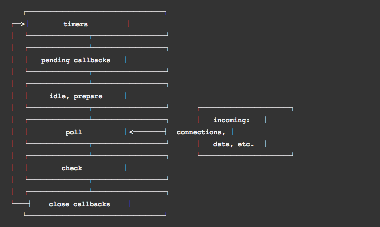

# START NODE

- REPL과 헬로 노드

- 호출 스택과 이벤트 루프

- 이벤트 기반, 싱글쓰레드, 논블러킹IO  
  


## REPL과 헬로 노드

- Read, Evalute, Print, Loop
  - **Read**: 사용자의 입력을 읽고, JavaScript 데이터 구조로 입력을 파싱하고, 메모리에 저장합니다.
  - **Eval**: 데이터 구조를 평가합니다.
  - **Print**: 결과를 인쇄합니다.
  - **Loop**: 사용자가 `ctrl`+`c`를 두 번 누를 때까지 명령을 반복합니다.
- console.log('hello node');  


## 호출 스택과 이벤트 루프

```javascript
/*
함수의 호출 third -> second -> first
*/
function first() {
    second();
    console.log('첫 번째');
}
function second() {
    third();
    console.log('두 번째');
}
function third() {
    console.log('세 번째');
}

first();
```

```javascript
/*
함수의 호출 시작 -> 끝 -> 3초후 실행 
*/
function run() {
    console.log('3초 후 실행');
}

console.log('시작');
setTimeout(run, 3000);
console.log('끝');
```

- 태스크 큐의 호출시기
  - setTimeout, setInterval, setImmediate, Promise resolve, reject, (async, await), 이벤트 리스너의 콜백  
- 이벤트 루프
- **timers**: 이 단계는 `setTimeout()`과 `setInterval()`로 스케줄링한 콜백을 실행합니다.
- **pending callbacks**: 다음 루프 반복으로 연기된 I/O 콜백들을 실행합니다.
- **idle, prepare**: 내부용으로만 사용합니다.
- **poll**: 새로운 I/O 이벤트를 가져옵니다. I/O와 연관된 콜백(클로즈 콜백, 타이머로 스케줄링된 콜백, `setImmediate()`를 제외한 거의 모든 콜백)을 실행합니다. 적절한 시기에 node는 여기서 블록 합니다.
- **check**: `setImmediate()` 콜백은 여기서 호출됩니다.
- **close callbacks**: 일부 close 콜백들, 예를 들어 `socket.on('close', ...)`
- 자세한 설명, [API](https://nodejs.org/ko/docs/guides/event-loop-timers-and-nexttick/)

## 이벤트 기반, 싱글 쓰레드, 논 블러킹IO

- 이벤트 기반(event driven)

- 싱글 쓰레드

- 논 블러킹IO

  - 기존의 동기식 IO는 디스크에 파일 쓰기를 요청하고, 디스크가 파일을 쓰는 동안 프로그램은 write에 멈춤
  - 비동기 IO는 파일 쓰기 요청을 할 때, 파일 요청이 끝나면 호출될 함수(callback)을 같이 넘긴다.
  - 프로그램은 다음 코드로 진행하다가, 파일을 다 쓰고 callback 호출을 통해 끝났음을 알고 다음 처리를 한다.

  


